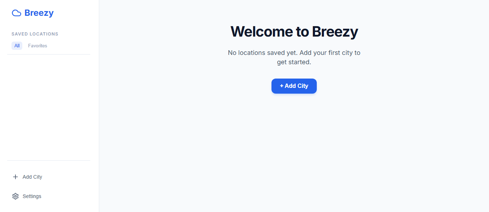
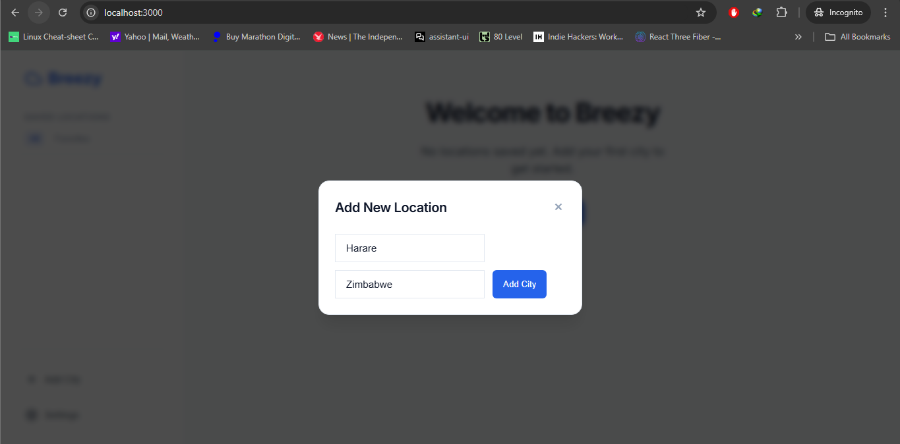
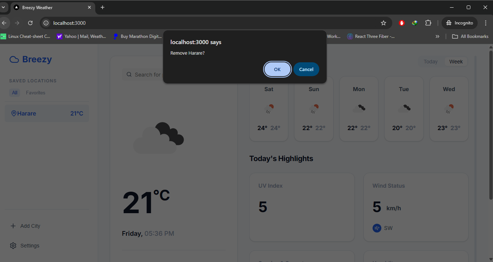

# Breezy Weather 🌬️

An advanced weather data integration platform built with Next.js 14, focusing on software engineering excellence, type safety, and a premium user experience.

## 🖼️ Screenshots

### Welcome Screen


### Adding a Location


### Favorites & Dashboards


### Managing Cities


## 🚀 Features

- **Real-time Weather**: Fetch current conditions for any city worldwide via OpenWeatherMap.
- **5-Day Forecast**: Predictive weather trends with detailed hourly data.
- **Background Sync**: Automated weather refreshes every 5 minutes using TanStack Query.
- **Persistence**: Hybrid persistence using SQLite (LibSQL) and Drizzle ORM.
- **Strict Validation**: All I/O validated with Zod schemas.
- **Premium UI**: Custom CSS Modules with a glassmorphism aesthetic and Sonner notifications.
- **Geocoding**: Automatic city resolution from name to coordinates.

## 🛠️ Tech Stack

- **Framework**: [Next.js 14 (App Router)](https://nextjs.org/)
- **Database**: [SQLite](https://www.sqlite.org/) with [Drizzle ORM](https://orm.drizzle.team/)
- **State Management**: [TanStack Query v5](https://tanstack.com/query)
- **Validation**: [Zod](https://zod.dev/)
- **Notifications**: [Sonner](https://sonner.emilkowal.ski/)
- **Testing**: Vitest
- **Containerization**: Docker
- **API**: OpenWeatherMap

## 📦 Getting Started

### 1. Prerequisites
- Node.js 18+
- pnpm

### 2. Setup
```bash
# Clone the repository
git clone https://github.com/your-username/breezy.git
cd breezy

# Install dependencies
pnpm install

# Setup Environment
cat <<'EOF' > .env.local
OPENWEATHER_API_KEY=your_key_here
NEXT_PUBLIC_APP_URL=http://localhost:3000
EOF

# Database Setup (creates ./data/sqlite.db)
pnpm run db:push
```

### 3. Run
```bash
pnpm run dev
```

## 🧪 Testing

Run unit tests with Vitest:

```bash
pnpm test
```

## 🐳 Docker

### With docker-compose (recommended)
```bash
OPENWEATHER_API_KEY=your_key_here \
NEXT_PUBLIC_APP_URL=http://localhost:3000 \
docker-compose up --build
```

### With plain docker
```bash
# Build
docker build --build-arg NEXT_PUBLIC_APP_URL=http://localhost:3000 -t breezy .

# Run (mounts persistent SQLite at /app/data/sqlite.db)
docker run \
  -p 3000:3000 \
  -e OPENWEATHER_API_KEY=your_key_here \
  -e NEXT_PUBLIC_APP_URL=http://localhost:3000 \
  -v breezy-data:/app/data \
  breezy
```

Notes:
- Database lives at `/app/data/sqlite.db` (created on first run by `drizzle-kit push`).
- To disable Next.js telemetry, set `NEXT_TELEMETRY_DISABLED=1` during build/run.

## 🏗️ Architectural Decisions

### Clean Architecture
Logic is separated into distinct layers:
- **Services**: Pure business logic and external API communication.
- **Hooks**: Centralized server-state management.
- **API Routes**: Type-safe REST endpoints with Zod validation.
- **Components**: Presentation layer following a modular design system.

### Why TanStack Query?
We chose TanStack Query to manage server state. It provides built-in caching, background revalidation, and optimistic updates, which are critical for a data-heavy weather application.

### Drizzle + SQLite
SQLite provides a lightweight, local-first experience. Drizzle adds type safety to our SQL queries without the overhead of heavy ORMs.

---
Built with ❤️ by Delvin Shoko
